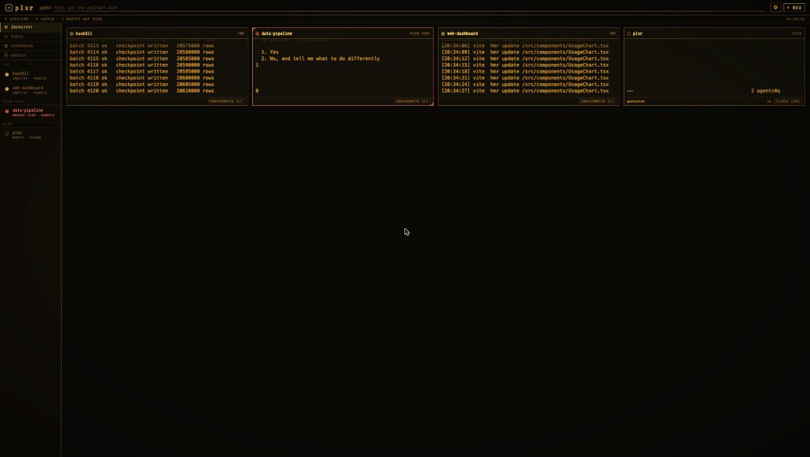
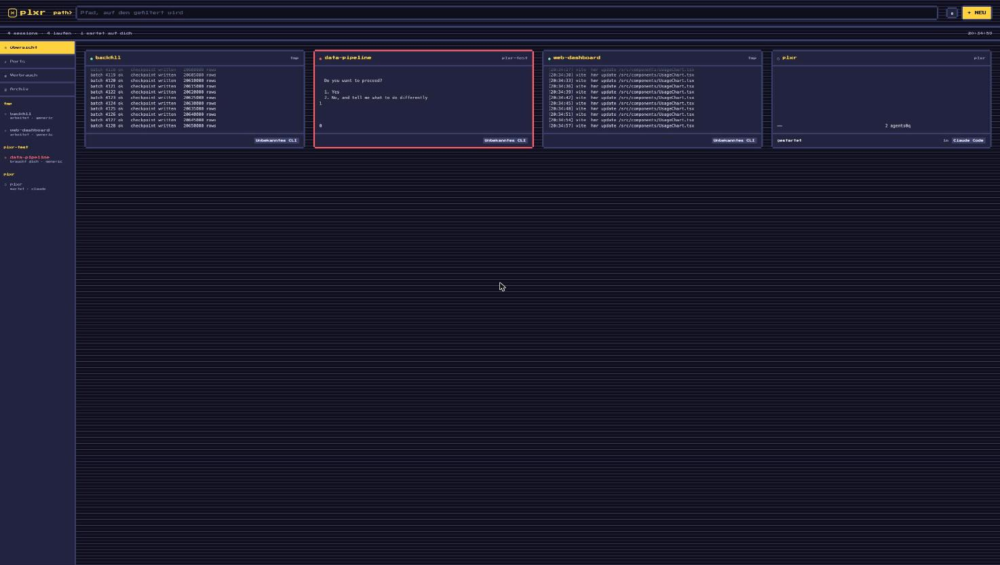
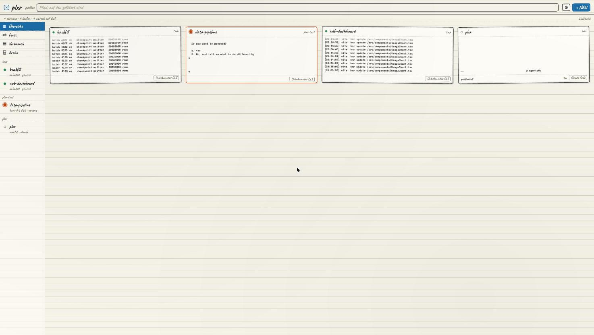

# plxr

Leitstand für Coding-CLI-Sessions. Startet `claude`, `codex`, `opencode`,
`aider` und Verwandte in Pseudo-Terminals, die einem Hintergrundprozess gehören
statt einem Terminalfenster, und zeigt alle gleichzeitig in einem Fenster.



## Wozu

Sessions liegen über viele Projektverzeichnisse verstreut, laufen in Fenstern,
die man zumacht, und man weiß nicht mehr, welche gerade auf eine Antwort
wartet. plxr zeigt sie als Kachelraster mit lebender Vorschau und markiert, wer
hängt.

## Installieren

```sh
curl -fsSL https://raw.githubusercontent.com/mg-pr/plxr/main/install.sh | sh
```

## Kommandozeile

```
plxr                    Fenster öffnen
plxr ls                 laufende Sessions
plxr new [pfad] [-- kommando …]
plxr attach <was>       Terminal an eine Session hängen (Strg-Q zweimal löst)
plxr kill <was>         Session beenden
plxr ports              belegte Ports
plxr update             auf die neueste Fassung bringen
```

`<was>` ist der Anfang der Session-ID oder ein Teil des Namens.

## Bauen

```sh
go install github.com/wailsapp/wails/v2/cmd/wails@latest
wails build -skipbindings
```

Für die Entwicklung der Oberfläche im normalen Browser:

```sh
go run . --serve
```

## Aufbau

| Paket | Aufgabe |
|---|---|
| `internal/core` | die Anwendung ohne Oberfläche — kennt keinen Transport |
| `internal/ptyhost` | Prozesse im PTY, Scrollback, Vorschau-Renderer |
| `internal/session` | Datenmodell und Registry unter `~/.plxr/sessions` |
| `internal/agent` | erkennt das laufende CLI und leitet den Status ab |
| `internal/fleet` | liest den Zustand, den ein Claude-Code-Hook schreibt |
| `internal/theme` | Themes und Skins, eingebaut plus importierbar |
| `internal/server` | HTTP/WebSocket — nur für den Browsermodus |
| `app.go` | Wails-Bindungen: Fenster ruft Go, Go schiebt Ereignisse |

Der Kern kompiliert für macOS, Windows und Linux. Die Fensterschicht baut auf
jedem System selbst, weil Wails gegen dessen Webview linkt.

## Was drin ist

- **Übersicht** — alle Sessions als Kacheln mit lebender Vorschau, Schiene
  links nach Projekt gruppiert, bleibt auch in einer Session stehen
- **Session** — bis zu vier Terminalflächen nebeneinander, Dateibaum mit
  Editor, die aufgelöste CLAUDE.md-Kette
- **Archiv** — abgelegte Unterhaltungen über alle Konten hinweg, mit
  Volltextsuche über den kompletten Verlauf
- **Ports** — was lauscht, und der Weg, es zu beenden
- **Verbrauch** — Token nach Tag, Projekt und Modell, aus den Transkripten
  gerechnet statt über eine API
- **Einstellungen** — Zahnrad oben rechts: Aussehen, eigene Themes, Anbindung
  an Claude Code, Fassung

## Konten

Wer mehrere Claude-Zugänge über `CLAUDE_CONFIG_DIR` fährt, sieht sie unter
`~/.claude`, `~/.claude2`, … automatisch. In einer laufenden Session lässt sich
das Konto wechseln: plxr kopiert das Transkript ins Zielkonto und startet die
Session dort mit `--resume` neu. Nötig, weil Claude Code Transkripte nur unter
dem eigenen Konfigurationsverzeichnis sucht.

## Status

Sessions melden ihren Zustand auf zwei Wegen:

- **Claude Code** meldet ihn selbst. `plxr setup-hook` trägt plxr in die
  Ereignisse von Claude Code ein; danach stehen Status, Tätigkeit, Modell und
  Kontextgröße fest statt geraten. Vorhandene Hooks bleiben unangetastet,
  `plxr unsetup-hook` nimmt es zurück.
- **Alle anderen** über den Bildschirminhalt: Profile unter `web/agents/*.json`
  erkennen Rückfragen und Spinner, dazu zählt, wie lange nichts mehr kam.

Ein neues CLI kommt als JSON dazu, ohne Neubau.

## Skins

Ein Theme wählt einen Skin — eine ganze visuelle Sprache, nicht nur Farben —
und darf dessen Palette überschreiben. Mitgeliefert: `crt`, `win95`, `pixel`,
`sketch`.

| | |
|---|---|
|  |  |

Eigene Themes landen in `~/.plxr/themes/*.json`:

```json
{
  "name": "mein-theme",
  "label": "Mein Theme",
  "skin": "crt",
  "palette": { "bg": "#0b0906", "fg": "#ffb000", "accent": "#ffcf5c" }
}
```

Ein Skin gestaltet die Klassen aus `web/base.css`. `./klassen.py` prüft, dass
kein Skin eine Klasse vergisst, die ein anderer gestaltet — und dass keine
Klasse erzeugt wird, die gar kein Stylesheet kennt.

## Lizenz

Apache 2.0. Frei und kostenlos, auch gewerblich.

## Mitmachen

Fehler und Vorschläge gern als Issue. Vor einem Pull Request `./check.sh`
laufen lassen — das prüft JavaScript, `go vet`, den Bau und den Querbau für
macOS, Windows und Linux.
