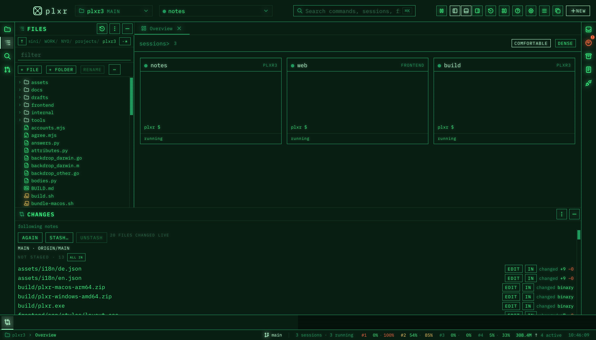
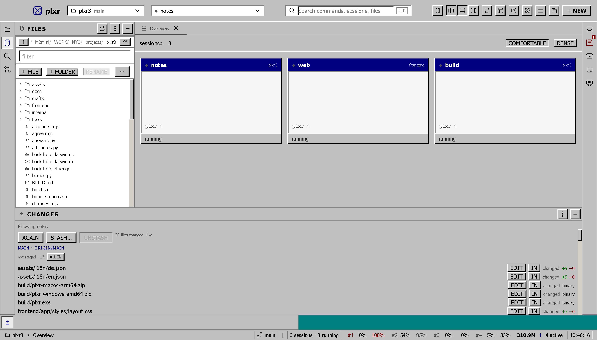
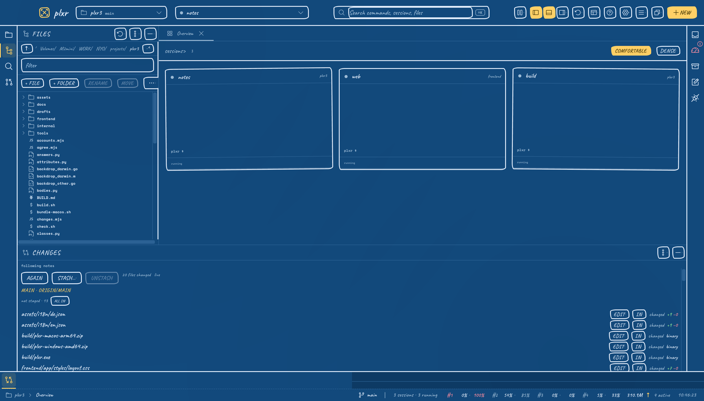
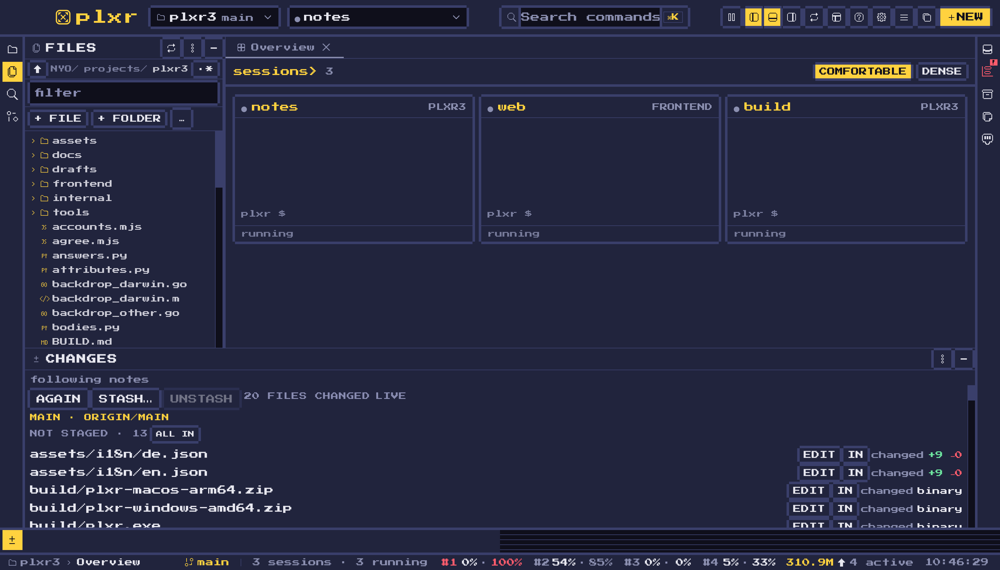

<div align="center">

# plxr

**The control room for your coding CLIs.**
Every session in one window — running, waiting, or wanting an answer — with the files, the diff and the terminal beside it.

[](https://github.com/nock-404/plxr/releases/latest)
[](#install)
[](https://github.com/nock-404/plxr/releases)



</div>

## Install

One command. It works out which system you are on, takes the newest release and puts it where that system keeps programs.

**macOS and Linux**

```sh
curl -fsSL https://raw.githubusercontent.com/nock-404/plxr/main/install.sh | sh
```

**Windows** (PowerShell)

```powershell
irm https://raw.githubusercontent.com/nock-404/plxr/main/install.ps1 | iex
```

Nothing else is touched: no package manager, no service, no admin rights — macOS gets `/Applications/plxr.app`, Linux `~/.local/bin/plxr` with a desktop entry, Windows `%LOCALAPPDATA%\Programs\plxr` with a Start-menu shortcut. Or take the archive for your system straight from the [releases](https://github.com/nock-404/plxr/releases/latest).

Once it runs it keeps itself up to date: a new version shows as a band at the top of the window, and one click installs it.

## What it does

A coding CLI — Claude Code, Codex, aider, Gemini, opencode — runs in a terminal, and after the third one you have lost track: which one is working, which one is waiting for you, which one stopped an hour ago. plxr is one window for all of them.

- **The board.** Every session as a tile, in the order that matters: the ones that want an answer first, then the working ones, then the quiet ones. Each tile shows its last lines, its folder and its state.
- **Real terminals.** Every session is a PTY that keeps running when the window closes — the daemon owns it, not the window.
- **The tools around it.** Projects, file tree, what has changed (with the diff), review, search, inbox, usage against your plan's limits, open ports, archive, notes. Each stands on the edge you put it on: left, right, or in the bottom section, which has a left and a right half of its own.
- **Templates and agents.** Start a session the way you always start it — folder, CLI, account, first prompt.
- **Four skins.** The tube, Windows 95, pen and paper, pixels. They are not colour schemes: each one draws the whole window its own way, with its own icon set.
- **Keyboard first.** `⌘K` for everything, `⌘1`…`⌘9` for the views, `⌘B` `⌥⌘B` `⌘J` for the edges, `⌘N` for a new session, `⌘W` to close a panel.
- **Yours, locally.** The daemon listens on 127.0.0.1 on a random port behind a token in `~/.plxr/daemon.json`. Nothing leaves the machine.

## The skins

| Windows 95 | Sketch | Pixel |
|---|---|---|
|  |  |  |

## Building it yourself

Go 1.23+ and Node 20+.

```sh
./build.sh      # the frontend, then the binary
./try.sh        # start this build in a home of its own, next to the installed one
./check.sh      # every gate: the static ones, the tests, and the window checks
```

`bundle-macos.sh` makes the .app; the Linux package is built by CI on a tag (`.github/workflows/linux.yml`), Windows cross-compiles from macOS.

## What it is made of

A Go daemon owns the sessions, the archive and the settings and serves an HTTP/WS API plus the interface; a Wails v3 window loads that interface; the interface itself is Next.js, statically exported, laid out with dockview. `BUILD.md` is the log of what is done and what is not.

Every set of icons and every library that ships with plxr is listed under **Settings → Licences**, with its licence in full.
